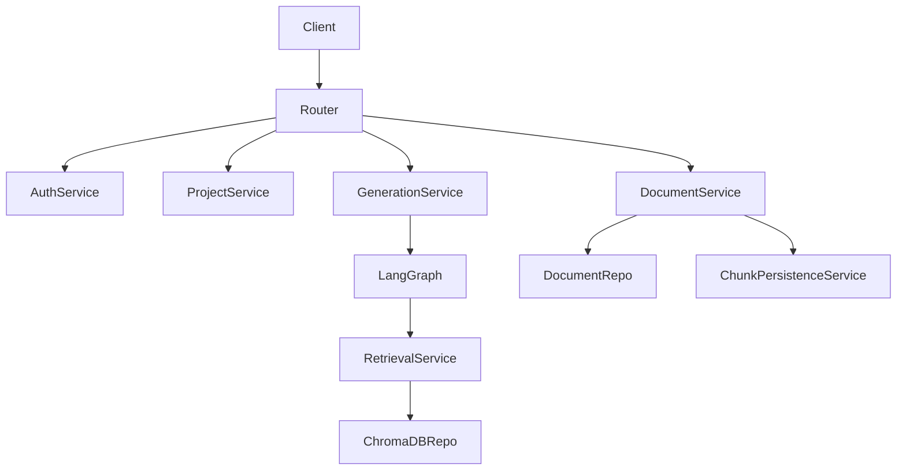

# Architecture

EduDeck AI follows **Clean Architecture** principles, decoupling business logic from HTTP transport and database layers.

## Layered Design
1. **API Router**: Validates Pydantic schemas and passes requests.
2. **Service Layer**: Pure Python logic containing business rules, LangGraph execution, and task orchestration.
3. **Repository Layer**: The only layer aware of SQLAlchemy sessions or ChromaDB clients.
4. **Database Models**: Declarative mapping for PostgreSQL.

## Mermaid Diagram

