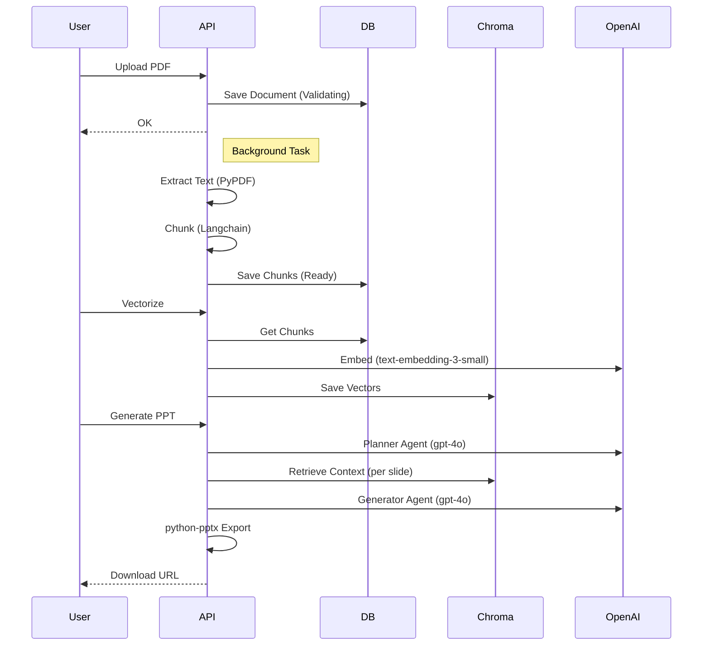

# Application Workflow

```mermaid
sequenceDiagram
    participant User
    participant API
    participant DB
    participant Chroma
    participant OpenAI
    
    User->>API: Upload PDF
    API->>DB: Save Document (Validating)
    API-->>User: OK
    
    Note right of API: Background Task
    API->>API: Extract Text (PyPDF)
    API->>API: Chunk (Langchain)
    API->>DB: Save Chunks (Ready)
    
    User->>API: Vectorize
    API->>DB: Get Chunks
    API->>OpenAI: Embed (text-embedding-3-small)
    API->>Chroma: Save Vectors
    
    User->>API: Generate PPT
    API->>OpenAI: Planner Agent (gpt-4o)
    API->>Chroma: Retrieve Context (per slide)
    API->>OpenAI: Generator Agent (gpt-4o)
    API->>API: python-pptx Export
    API-->>User: Download URL
```
